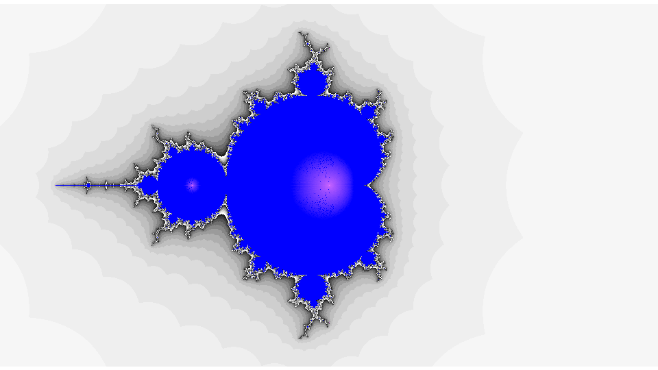

__<span style=" font-size:4em;"> Fractals </span>__

Fractals is a school project to <span style="color: purple;">_ _ init _ _</span> ourselves to python.  
This projects is a program that generates fractals and display them.

---

## How to generate fractals :
In this project we are only focusing on Julia set and Mandelbrot fractals.  
To generate a Julia fractal we analise the limit of the following sequence of a complex z:  
<div align="center">
    <em>f</em> (z) = z² + c
</div>
where z correspond to every pixel of the screen and c the constant complex 
that define the fractal.

So if the sequence converge, we display a color and if the sequence diverge, we display a scale of grey.
The color and gray intensity are define by the velocity of the convergence or divergence.

## Some examples of fractals :

<div align="center">
  Julia fractal with constant complex to -1
</div>



<div align="center">
  Mandelbrot fractal
</div>

 ---
## Packages 
After downloading the project,
you can download the package needed by 
opening a command prompt in the 
project file and executing the 
following command:
``` 
py -m pip install -r requirement_package.txt
```
 ## Language :

<p align="left"> <a href="https://www.python.org" target="_blank" rel="noreferrer">  </a> </p>

---
## Authors

- [@Pumchh](https://www.github.com/Pumchh)
- [@nicopyright](https://www.github.com/nicopyright)

